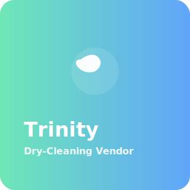

# Dry Cleaning Vendor App

This is a code bundle for Dry Cleaning Vendor App. 

## Running the code

Run `npm i` to install the dependencies.

Run `npm run dev` to start the development server.

<!-- Visual header: small badges and a sticker to make the repo more inviting -->
  

<p>
  
  
  
</p>

## Student Impact & Technical Overview

### Impact on Students

This application is purpose-built to make laundry and dry-cleaning services accessible, reliable, and efficient for students who juggle classes, part-time jobs, and campus life. The app's impact includes:

- **Time Savings:** Automated ordering, scheduling, and pickup/dropoff tracking reduce the time students spend managing laundry, freeing up hours per week for study or extracurriculars.
- **Accessibility & Convenience:** A mobile-friendly web UI and clear workflows let students place and track orders from any device, reducing friction for users with tight schedules or limited transport options.
- **Cost Transparency:** Integrated vendor pricing and quick-add features help students compare options and manage budgets — ideal for financially conscious users.
- **Reliability & Trust:** Real-time order tracking and vendor verification lower the cognitive load and anxiety around outsourcing essential chores.
- **Safety & Data Privacy:** Authentication and minimal required personal data protect student privacy while enabling useful features like order history and saved preferences.
- **Skill-Building Opportunities:** For campuses running this as a student-supported service, the app provides hands-on experience with product management, customer support, and technical operations.

### Why This Stands Out To Recruiters

This project demonstrates a strong blend of product thinking, front-to-back engineering, and user empathy — the combination recruiters look for in early-career and mid-level candidates:

- **End-to-end Product Ownership:** The codebase shows a complete user flow (onboarding → ordering → tracking → profile), which signals experience building shipped features, not just isolated UI components.
- **User-centered Design:** Documentation and component structure emphasize clear UX patterns (forms, onboarding, order tracking), indicating attention to usability and accessibility.
- **Scalable Patterns:** Separation of components, contexts, and utilities implies an architecture that can grow with features and users.
- **Realtime & Integrations:** Use of cloud services (e.g., Supabase for auth and data) highlights experience integrating managed backend services rather than reinventing common infrastructure.

### Technologies Used (and Why)

- **React + TypeScript:** Strongly typed components improve maintainability, refactors, and catch many bugs at compile time — a must for production apps.
- **Vite:** Fast development startup and HMR streamline developer iteration and reduce feedback loops.
- **Supabase (Auth + Database + Functions):** Provides production-ready authentication, hosted Postgres, and serverless function patterns that let developers focus on features instead of ops.
- **Modular Component Library:** The `src/components` and `src/components/ui` structure shows a reusable component approach, improving consistency across screens.
- **CSS / Global Styles:** Centralized styling delivers predictable visual behavior across devices; the project is set up for easy adoption of utility frameworks (e.g., Tailwind) or design systems.
- **Maps & Vendor Features:** Vendor mapping and geo-features (where present) demonstrate integrating third-party APIs and building location-aware functionality.

### Architecture & Maintainability

- **Clear Separation:** UI components, contexts (e.g., `ThemeContext`), utilities, and supabase clients are split into dedicated folders for clarity and testability.
- **Serverless Functions:** The `supabase/functions` folder shows intent to run lightweight server-side logic near the database, which improves latency and security for sensitive operations.
- **Extensible Data Model:** Vendor, order, and user abstractions in the codebase make it straightforward to add features like coupons, scheduling rules, or analytics events.

### Security, Performance & Scalability Considerations

- **Authentication & Least Privilege:** Auth via Supabase limits exposure of user data; follow role-based policies in the database to further secure vendor/customer boundaries.
- **Rate-limiting & Caching:** Use edge caching for static assets and short-lived caches for lists to reduce backend load as adoption grows.
- **Monitoring & Observability:** Add lightweight analytics (page events, order funnel), error tracking, and server logs to measure reliability and prioritize improvements.

### Metrics & Success Criteria (Suggested)

- **Adoption:** Active users per week (students who place an order).
- **Time Saved:** Average minutes saved per order compared to manual alternatives.
- **Order Completion Rate:** Percent of placed orders that complete successfully without manual intervention.
- **NPS / Satisfaction:** Short surveys or in-app rating after pickup/delivery.

### How Recruiters Should Evaluate This Project

- **Product Thinking:** Look for rationale in commit messages and docs that explain why features exist (user problem → solution → outcome).
- **Code Quality:** Assess component reuse, TypeScript typing, and separation of concerns in `src/components`, `contexts`, and `utils`.
- **Integration Skill:** Examine how the app integrates with Supabase, environment configuration, and how server-side logic (functions) is structured.
- **Testing & CI:** Prefer projects with unit/integration tests and automated pipelines. If missing, note this as an opportunity to add `vitest`/`jest` and a GitHub Actions workflow.

### Visuals & Stickers

To make the repository more attractive to recruiters and reviewers, this project includes a small set of lightweight SVG stickers and icons in `assets/stickers/`. They are intentionally simple, vector-based, and fully editable so you can reuse them across the README, landing pages, or demo mockups.

- `assets/stickers/sticker-trinity.svg`: a project sticker suitable for the top of the README or a demo landing screen.
- `assets/stickers/icon-time.svg`: a small clock icon useful next to features that save students time.
- `assets/stickers/icon-map.svg`: a location/pin icon useful for vendor map and geo-related features.

Usage examples (Markdown):

```

  Time-saving features
```

If you'd like different colors, shapes, or more stickers (badges, device mockups, etc.), tell me which style you prefer (flat, outline, gradient) and I will generate additional SVGs and update the README to show alternate variations.
  